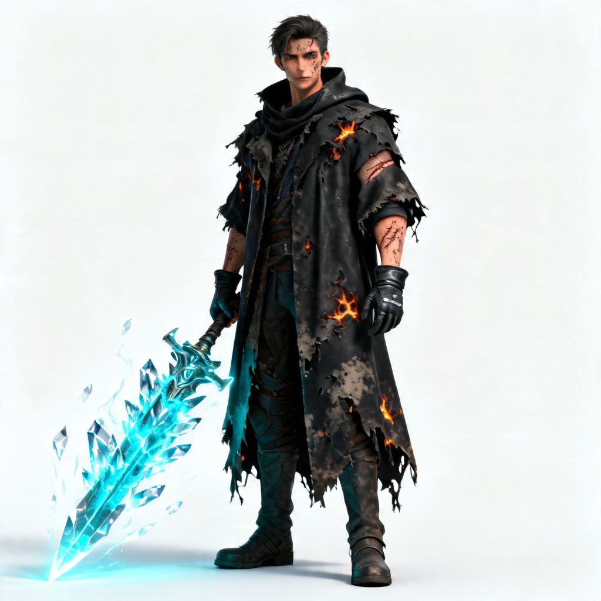
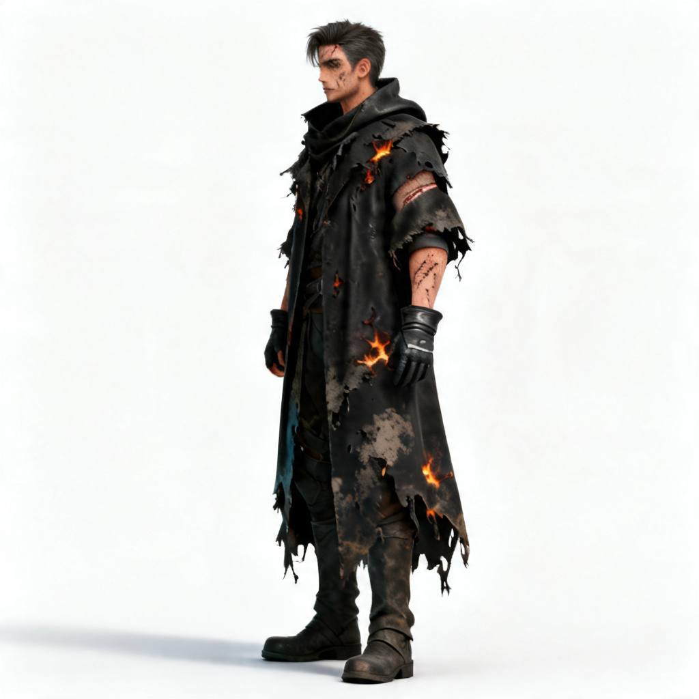
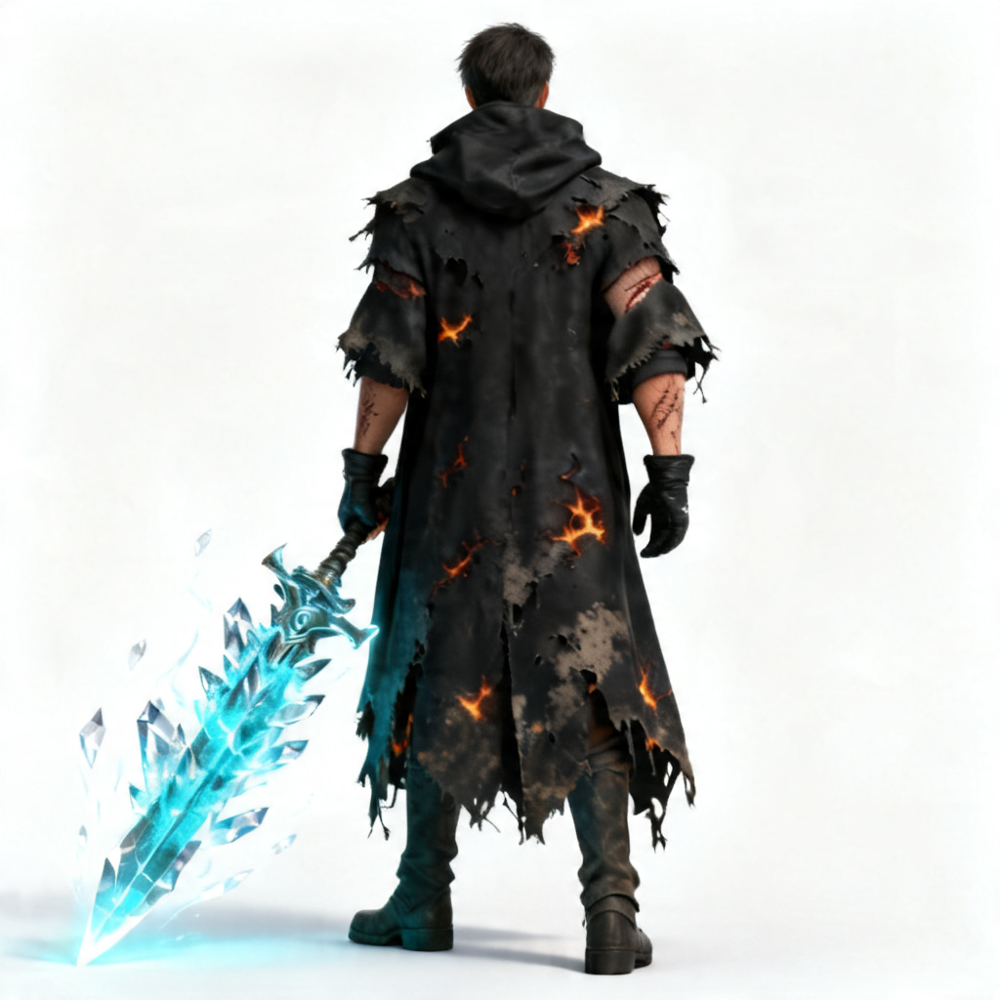
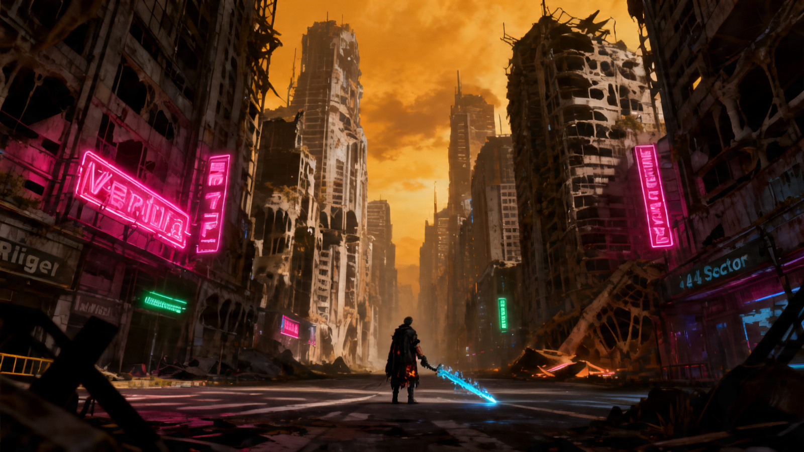
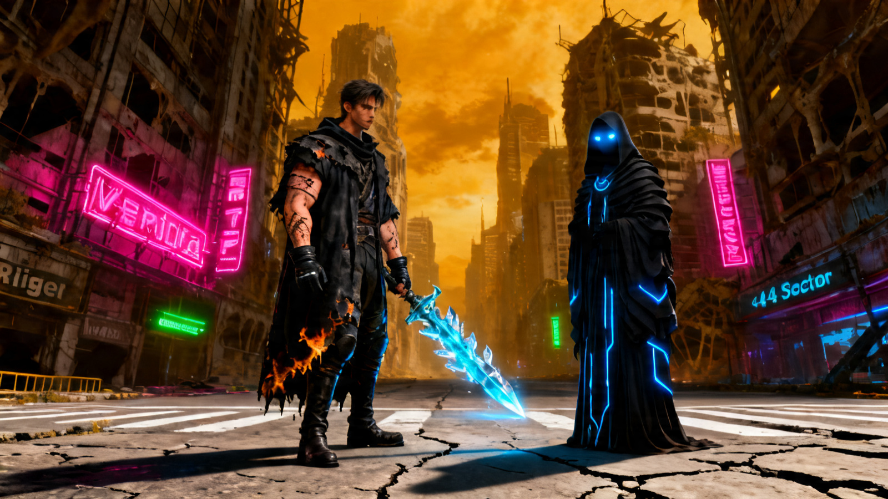
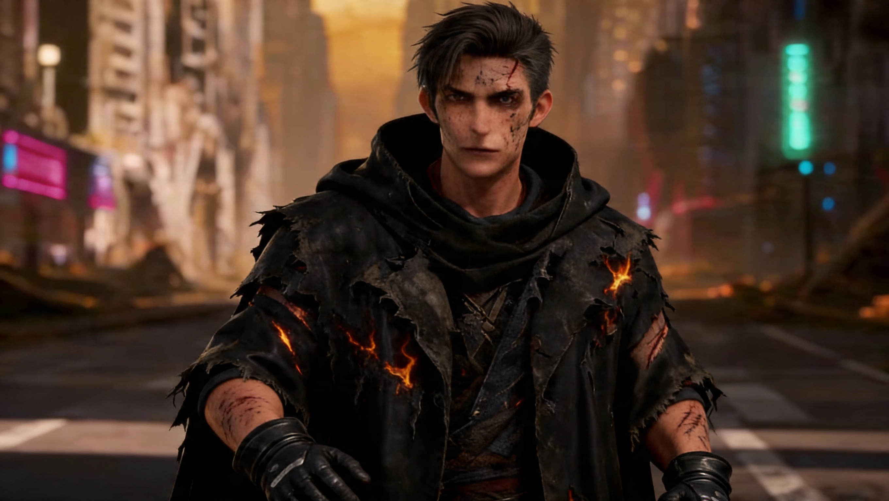
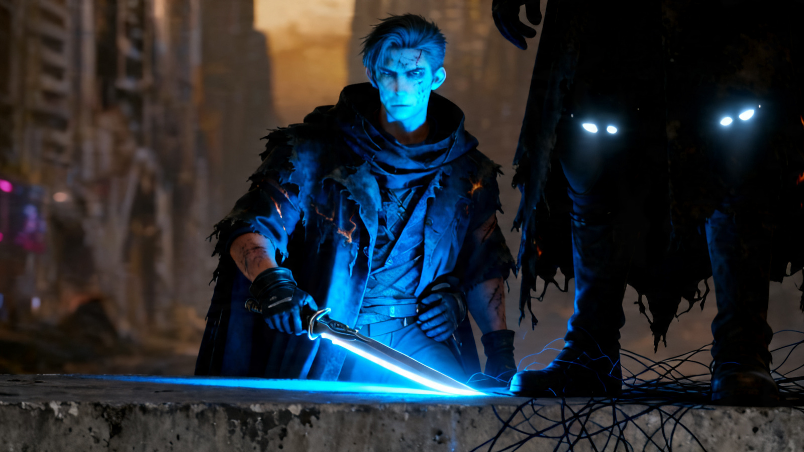
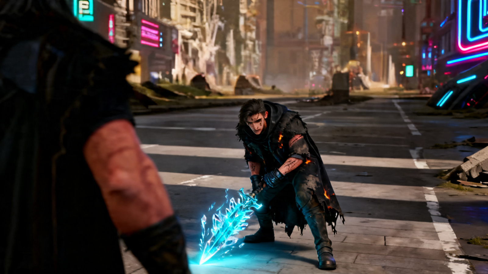

# ViMax 演示：Idea-to-Video 完整工作流说明

本文档主要讲解 ViMax `idea2video` 完整工作流，即通过一个纯文本的提示词经过一系列智能体联合工作，最终生成一段完整的视频。

演示源文件位于 [`demo/ViMax_output/`]( demo/ViMax_output/vimax_outputs/idea2video/final_video.mp4)。

---

## 输入

整个工作流的起点是一段自然语言描述，包含故事类型、基调、角色和戏剧意图。无需提供任何图像、脚本或手工分镜。

**本次 Demo 的输入（概要）：**

> *暗黑奇幻赛博朋克短片。单场景。在废墟城市 Neo-Veridia，独行战士 Kael 与一个无名神秘人物"先知（The Oracle）"展开最后的对决。*

以下所有内容均由此完全自动化生成。

---

## 第一阶段 — 故事展开

**输出：** [`story.txt`](demo/ViMax_output/vimax_outputs/idea2video/story.txt)

工作流将输入提示词展开为一篇完整叙事，建立世界观、角色设定和逐镜头动作描述，作为后续阶段的创作基础。

<!-- **Demo 节选：**

> *在 Neo-Veridia 的残骸之中，笼罩在腐蚀性烟雾与垂死的霓虹灯下，战士 Kael 与那个只被称为"先知"的神秘人物展开最后的对决。Kael 身负绑缚在剑上的古老发光技术，寻求一个答案——或许只是为了给他毫无结果的朝圣之旅画上一个明确的句号。*

本次 Demo 共定义了三个镜头：
- **镜头 1** — 超大远景，Kael 进入废弃街道
- **镜头 2** — 中近景，他拔出 Luminar 光刃，与先知对峙
- **镜头 3** — 越肩镜头，Kael 冲刺，画面切入刺眼白光 -->

---

## 第二阶段 — 剧本格式化

**输出：** [`script.json`](demo/ViMax_output/vimax_outputs/idea2video/script.json)

叙事被重构为机器可读的剧本格式：场景标题、动作描述（角色台词和音效代码仍在优化中）。

<!-- 视觉描述与音频线索在此阶段分离，以便后续各自独立处理。 -->

<!-- **Demo 节选（镜头 2 音频部分）：**

```
[说话人] Kael："终结它。或者把钥匙给我。"
[音效] Luminar 光刃点燃时发出强烈嗡鸣声，
       导致附近霓虹灯的杂音急剧抖动。
``` -->

---

## 第三阶段 — 角色提取

**输出：** [`characters.json`](demo/ViMax_output/vimax_outputs/idea2video/characters.json)

从故事中提取角色，并结构化其视觉描述——包括静态特征（外貌）和动态特征（服装、道具、姿态）。这些描述将成为肖像生成阶段的规格说明。

**Demo 角色信息：**

| 角色 | 静态特征 | 动态特征 |
|------|---------|---------|
| Kael | 30多岁，脸上有伤疤的独行战士 | 破旧黑色合成纤维斗篷，等离子灼烧痕迹，戴手套，持 Luminar 数据刃 |
| The Oracle（先知） | 无面，深邃黑暗，轮廓吸收所有光线 | 层叠厚重的古朴长袍；兜帽深处有两点冰冷白色数据光点 |

---

## 第四阶段 — 角色肖像生成

**输出：** [`character_portraits/`](demo/ViMax_output/vimax_outputs/idea2video/character_portraits/)
**注册表：** [`character_portraits_registry.json`](demo/ViMax_output/vimax_outputs/idea2video/character_portraits_registry.json)

为每个角色生成三个参考肖像——正面、侧面、背面。这些肖像作为视觉身份锚点，用于后续所有图像和视频生成阶段。若缺少一致的肖像参考，同一角色在不同镜头中的外观将出现漂移。

```
character_portraits/
├── 0_Kael/
│   ├── front.png    ← 近景镜头的主要参考
│   ├── side.png
│   └── back.png
└── 1_The Oracle/
    ├── front.png
    ├── side.png
    └── back.png     ← 镜头 3 越肩构图的参考（从先知背后拍摄）
```

| | 正面 | 侧面 | 背面 |
|---|---|---|---|
| **Kael** |  |  |  |
| **The Oracle** |  |  |  |

---

## 第五阶段 — 分镜规划

**输出：** [`scene_0/storyboard.json`](demo/ViMax_output/vimax_outputs/idea2video/scene_0/storyboard.json)

每个场景被分解为若干镜头，每个镜头包含明确的 `visual_desc`（视觉描述）和 `audio_desc`（音频描述）（代码仍在优化中）字段，以及该镜头中出现的角色索引（`vis_char_idxs`）和是否为场景末镜（`is_last`）。

<!-- **Demo — 镜头 3 分镜条目：**

```json
{
  "idx": 2,
  "is_last": true,
  "cam_idx": 2,
  "visual_desc": "越肩镜头，从先知厚重黑袍背后拍向 Kael。Kael 居中，
                  身体前倾，神情充满对抗，持蓝宝石光刃冲刺。
                  光刃的明亮蓝光与先知领域的吸光黑暗相撞，
                  瞬间爆发出刺眼的白色闪光。",
  "audio_desc": "[说话人] Kael：（嘶吼）[音效] 声音骤然切断。"
}
``` -->

---

## 第六阶段 — 摄像机树构建

**输出：** [`scene_0/camera_tree.json`](demo/ViMax_output/vimax_outputs/idea2video/scene_0/camera_tree.json)

这是 ViMax 的核心结构设计之一。每个摄像机/镜头被置于一个父子层级结构中。生成某镜头的首帧时，系统可从其父镜头向下传递视觉上下文——环境、光照、角色外观——而不是每帧都从零开始生成，彼此毫无记忆。

**Demo 摄像机树：**

```
摄像机 0  （超大远景 — Kael 进入街道）         [根节点]
    └── 摄像机 1  （中近景 — Kael 拔剑）
            └── 摄像机 2  （越肩镜头 — 冲刺与白光）
```

每个节点记录：
- `parent_cam_idx` — 从哪个镜头继承上下文
- `is_parent_fully_covers_child` — 父帧是否足以覆盖子镜头所需信息
- `missing_info` — 父帧中缺失、需要在子镜头中重新生成的视觉信息

**示例：** 摄像机 1 的父节点（摄像机 0）无法完全覆盖子镜头，因为中近景的取景范围内不包含街道全景的环境信息。系统记录此缺口并在帧生成时加以补偿。

---

## 第七阶段 — 帧生成（首帧与末帧）

**每个镜头的输出：** `first_frame.png`、`last_frame.png`、`first_frame_selector_output.json`、`last_frame_selector_output.json`

为每个镜头生成两张关键帧：开场构图和收场构图。图像生成提示词由系统自动组装，综合使用：

1. 角色肖像（作为外观一致性的参考图像）
2. 父镜头已生成的帧（作为环境/上下文连续性的参考）
3. 分镜视觉描述（作为文字提示词）

**Demo — 镜头 2 首帧提示词（简化）：**

> *Kael 的中近景（外观参考：`0_Kael/front.png`）。神情紧绷但专注。右手拔出 Luminar，爆发出冰蓝色光芒。背景：来自父镜头（镜头 0 的帧）的模糊城市街道，保持相同光照和氛围。*

**Demo — 镜头 3 首帧提示词（简化）：**

> *从先知背后的越肩构图（外观参考：`1_The Oracle/back.png`）。Kael 居中，身体前倾，持蓝宝石光刃（参考：`0_Kael/front.png`）。背景与构图参考摄像机树候选帧 `new_camera_2.png`。*

**各镜头关键帧展示：**

| 镜头 | 首帧 | 末帧 |
|------|------|------|
| **镜头 1** — 超大远景 |  |  |
| **镜头 2** — 中近景 |  |  |
| **镜头 3** — 越肩 / 白光 |  |  |

---

## 第八阶段 — 单镜头视频生成

**每个镜头的输出：** `scene_0/shots/{n}/video.mp4`

每个镜头从首帧动画化至末帧，生成一段视频片段。分镜中的运动描述用于指导动画运动方向。

**Demo 运动描述：**

- **镜头 1：** 静止机位。Kael 走入画面并停下。先知在其旁边具象化。兜帽深处白色数据光点短暂亮起。
- **镜头 2：** 静止中近景机位。Kael 拔出 Luminar，蓝色光芒爆发。先知脚下的地面出现暗色能量裂纹。
- **镜头 3：** 镜头快速推进至冲击点。刺眼白光吞噬画面。

---

## 第九阶段 — 转场生成

**输出：** 各镜头文件夹内的 `transition_video_from_shot_{n}.mp4`

在相邻镜头之间生成平滑过渡片段。每次过渡会生成多个候选版本并缓存，以便选取视觉上最连贯的切换方式。

```
shots/1/
├── transition_video_from_shot_0.mp4           ← 镜头 0 → 镜头 1 的过渡
└── cache/
    ├── transition_video_from_shot_0-Scene-001.mp4
    └── transition_video_from_shot_0-Scene-002.mp4

shots/2/
├── transition_video_from_shot_1.mp4           ← 镜头 1 → 镜头 2 的过渡
└── cache/
    ├── transition_video_from_shot_1-Scene-001.mp4
    ├── transition_video_from_shot_1-Scene-002.mp4
    └── transition_video_from_shot_1-Scene-003.mp4
```

---

## 第十阶段 — 场景合成

**输出：** [`scene_0/final_video.mp4`](demo/ViMax_output/vimax_outputs/idea2video/scene_0/final_video.mp4)

将各镜头片段与对应的过渡片段按顺序拼接，生成完整的场景视频。

```
镜头 0 视频  +  转场 0→1  +  镜头 1 视频  +  转场 1→2  +  镜头 2 视频
                                    ↓
                          scene_0/final_video.mp4
```

---

## 第十一阶段 — 最终合并

**输出：** [`final_video.mp4`](demo/ViMax_output/vimax_outputs/idea2video/final_video.mp4)

所有场景视频拼接成最终输出。

<!-- 此Demo 只有一个场景，因此 `final_video.mp4` 与 `scene_0/final_video.mp4` 相同。 -->

---

## 端到端流程总览

```
文字提示
    │
    ├─ [第一阶段]  故事展开        → story.txt
    ├─ [第二阶段]  剧本格式化      → script.json
    ├─ [第三阶段]  角色提取        → characters.json
    ├─ [第四阶段]  肖像生成        → character_portraits/{name}/{front,side,back}.png
    ├─ [第五阶段]  分镜规划        → scene_N/storyboard.json
    ├─ [第六阶段]  摄像机树构建    → scene_N/camera_tree.json
    ├─ [第七阶段]  关键帧生成      → shots/N/{first,last}_frame.png
    ├─ [第八阶段]  单镜头视频生成  → shots/N/video.mp4
    ├─ [第九阶段]  转场生成        → shots/N/transition_video_from_shot_M.mp4
    ├─ [第十阶段]  场景合成        → scene_N/final_video.mp4
    └─ [第十一阶段] 最终合并       → final_video.mp4
```

<!-- **几个值得关注的核心设计决策：**

- **摄像机树**：跨镜头传递视觉上下文，无需独立的角色追踪模型，显著降低角色外观漂移问题。
- **多角度肖像**：为每个镜头的图像生成提供稳定的角色视觉参考，无论摄像机角度如何变化。
- **视觉与音频描述分离**：在剧本阶段分离两种模态，使各自能由最合适的模型独立处理。
- **转场候选缓存**：每次剪切点生成多个候选版本，可在不重跑整条流水线的情况下进行质量筛选。 -->
